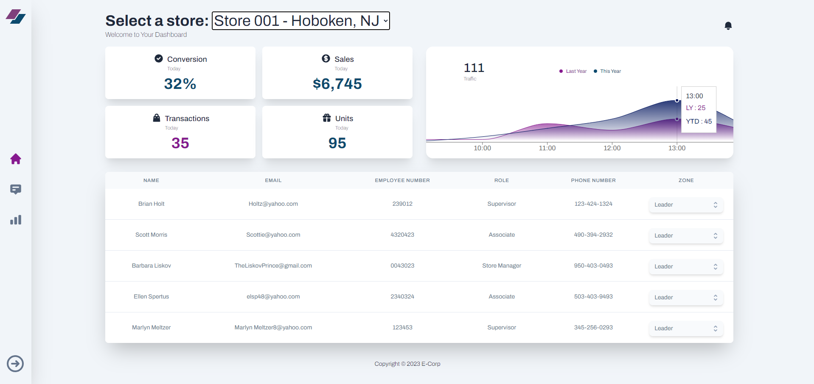
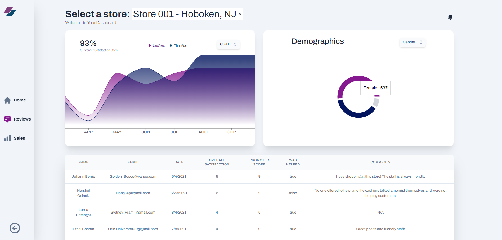
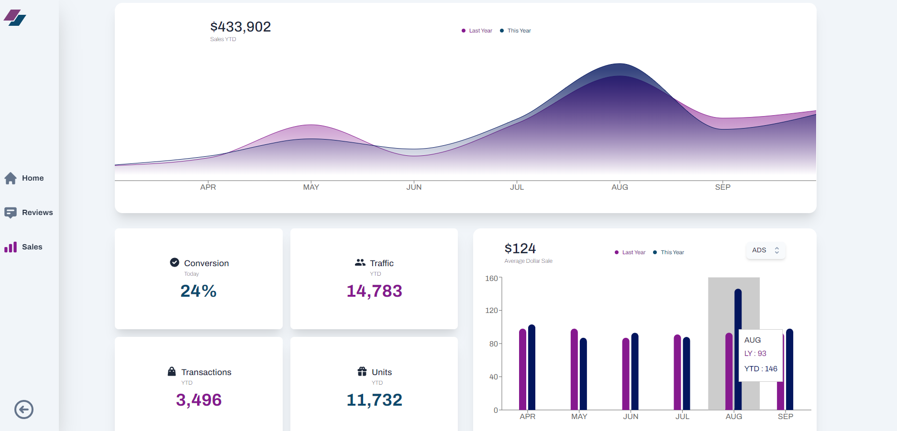

# 🚀 React Dashboard

https://dashboard-g5rs.onrender.com/

## Overview

React Dashboard is a powerful application that provides insightful visualizations and analytics. The app is structured around three main logical pages, each catering to specific functionalities.

## Home Page

The Home Page serves as the central hub, offering a comprehensive overview of key performance indicators (KPIs) and essential data. It includes:

- **📊 Boxes for Current KPIs:** Instantly view and track the current performance metrics.

- **📈 Traffic Graph:** Visual representation of traffic trends throughout the day.

- **👥 Employee Information Table:** Access a table containing relevant employee details.

## Reviews Page

Dive into customer feedback and satisfaction on the Reviews Page, featuring:

- **🌟 Customer Satisfaction Line Chart:** Track the satisfaction score trends over time.

- **📊 Demographics Circle Chart:** Visualize demographic distribution at a glance.

- **💬 Reviews Table:** Explore detailed reviews and comments from users.

## Sales Dashboard

For a detailed analysis of sales-related metrics, head to the Sales Dashboard, which includes:

- **💰 Year-to-Date Sales Line Chart:** Compare current year sales with the previous year.

- **📈 Year-to-Date KPI Boxes:** Display important key performance indicators for the ongoing year.

- **💸 Average Transaction Amount Column Chart:** Analyze the average amount spent per transaction.

## App Environment

Pictures of the app environment:

